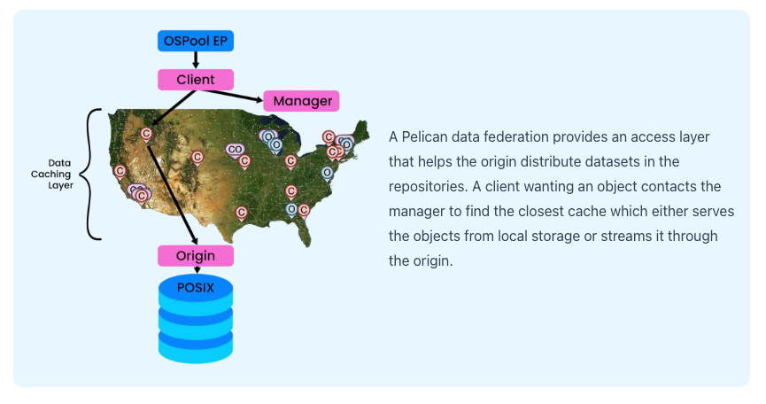

# Pelican documentation

## How this repository is set up

To ease development of documentation this repository is the one-stop shop for creating new documentation. To do this 
it uses some symbolic linking both in the files and in git. 

The authoritative copy of the documentation lives in the pelican repo under the `/docs/pages` directory. This repository
uses git submodules to pull in the pelican repo and a symlink to link those pages to the correct location for the
documentation to be built. This means that when you change files in the pages directory you will need to commit those to 
the pelican repo, rather than the `docs` repo.

## Editing Documentation

This website uses [Nextra](https://nextra.site/) to build the documentation, it is suggested to look at their
[documentation](https://nextra.site/docs).

Some key documents that would be good to look through are:
- [Organize Files](https://nextra.site/docs/guide/organize-files)
- [Markdown](https://nextra.site/docs/guide/markdown)
- [Custom Doc Components](https://nextra.site/docs/guide/built-ins)

### Editing locally

Before you can edit locally on your computer you must edit the `env.local` file so that `PELICAN_PATH` points to your local
instance of pelican. This will allow the website builder to symlink in the appropriate files so that you can edit your 
finalize your documentation here, then commit the final product in your own repo.

```shell
# Install appropriate node_modules
npm i
```

```shell
# Run the dev server to see your documentation
npm run dev
```

### Adding Images

All images should be added to the `/public` folder. You can add them into the documentation by using the markdown image
syntax. All the images are served from website root so make sure not to let the image paths collide with the website. 

```markdown

```

## Recipes

Below is a list of all the components available to use in your markdown. Let Cannon know if you want access to any
others.

### ImageRow



```jsx
// At the top of your markdown file
import ImageRow from "@/components/ImageRow";

// Whereever you want a row with image on the left 50% with text on the right 50%
<ImageRow alt={"Pelican and OSDF"} src={"/pelican/pelican-and-osdf.png"}>
	A Pelican data federation provides an access layer that helps the origin
	distribute datasets in the repositories.  A client wanting an object contacts
	the manager to find the closest cache which either serves the objects from
	local storage or streams it through the origin.
</ImageRow>
```